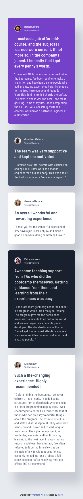
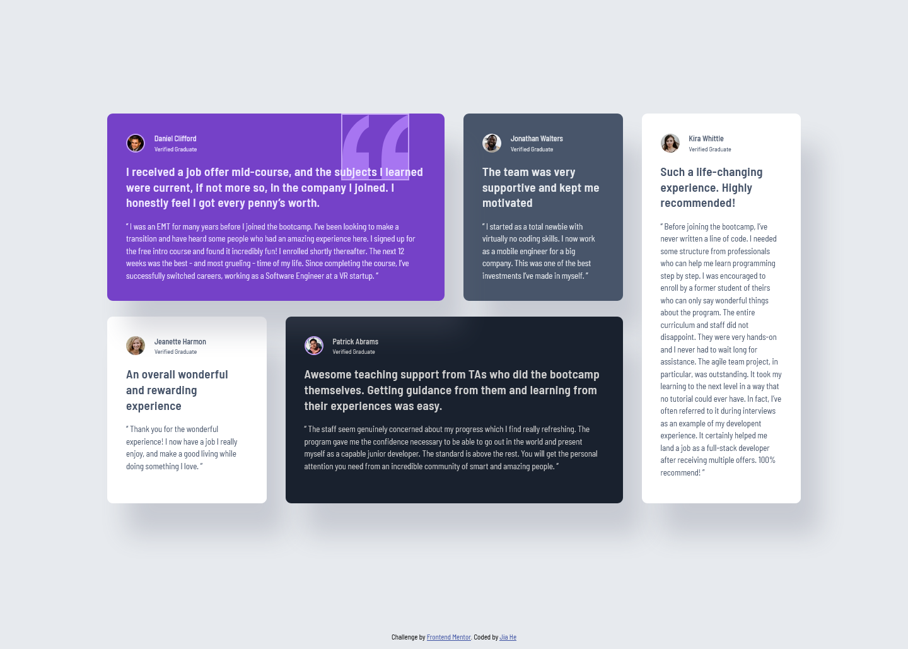

# Frontend Mentor - Testimonials grid section solution

This is my solution to the [Testimonials grid section challenge on Frontend Mentor](https://www.frontendmentor.io/challenges/testimonials-grid-section-Nnw6J7Un7). Frontend Mentor challenges help you improve your coding skills by building realistic projects.

## Table of contents

- [Overview](#overview)
  - [The challenge](#the-challenge)
  - [Screenshot](#screenshot)
  - [Links](#links)
- [My process](#my-process)
  - [Built with](#built-with)
  - [What I learned](#what-i-learned)
  - [Continued development](#continued-development)
  - [Useful resources](#useful-resources)
- [Author](#author)

## Overview

### The challenge

Users should be able to:

- View the optimal layout for the site depending on their device's screen size

### Screenshot

#### 📱 Mobile



#### 💻 Desktop



### Links

- Solution URL: [My solution]()
- Live Site URL: [Live site URL](https://testimonial-grid-section-jiah.netlify.app/)

## My process

### Built with

- Semantic HTML5 markup
- CSS custom properties
- Flexbox
- CSS Grid

### What I learned

While building this component, I practiced:

- Using CSS Grid to layout the testimonials container and place each testimonial in its designated grid area

- Used Flexbox to lay out the testimonials on smaller screens

Here's a small snippet I'm proud of:

```html
<h1>Some HTML code I'm proud of</h1>
```

```css
.testimonials {
  display: grid;
  grid-template-columns: repeat(4, 1fr);
  grid-template-rows: repeat(2, 1fr);
  column-gap: 3rem;
  row-gap: 2.5rem;
}

@media (max-width: 62.5em) {
  .testimonials {
    display: flex;
    flex-direction: column;
    gap: 3rem;
  }
}
```

### Continued development

I want to explore more layout and responsive design using CSS Grid in the future.

### Useful resources

- [Google fonts -- Barlow Semi Condensed](https://fonts.google.com/specimen/Barlow+Semi+Condensed)

## Author

- Frontend Mentor - [@JiaHe35354](https://www.frontendmentor.io/profile/JiaHe35354)
